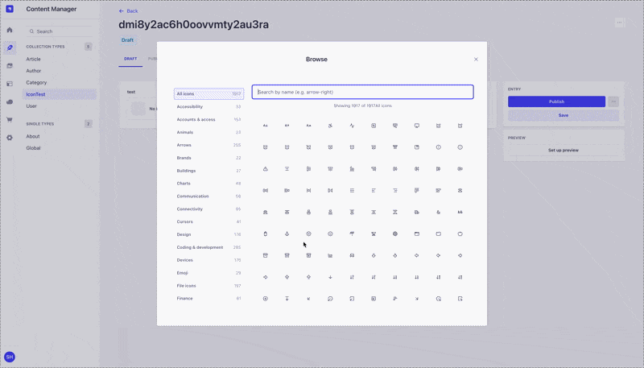

# Strapi Lucide Icons

<p align="center">
  
</p>

<p align="center">
  <a href="https://www.npmjs.com/package/strapi-lucide-icons">
    
  </a>
  <a href="https://github.com/shx08/strapi-lucide-icons">
    
  </a>
  
  
  
</p>

---

**Strapi Lucide Icons** adds a custom field to Strapi so editors can pick any Lucide icon from a searchable list. The saved value is the **icon name**, so you can render it anywhere on the client side with **lucide-react**, **lucide-svelte**, **lucide-vue**, **lucide-solid**, or any other Lucide package.\n\nThis build uses **lucide-react 0.564.0**.

## ✨ Features

- Custom field: `icon` (string)
- Full Lucide icon catalog with categories
- Searchable dialog with icon preview
- Light/Dark theme support
- Responsive layout (mobile → desktop)
- Built-in i18n with extensible translations

## ✅ Requirements

- Strapi v5

## 🚀 Usage

1. Install the plugin in your Strapi app.
2. Enable the plugin.
3. In Content-Type Builder, add the **Lucide Icons** custom field.
4. Pick an icon and save.

The saved value is the **icon name** (e.g. `alarm-clock`, `chart-no-axes-gantt`).

## 🎨 Theme Support

**Light theme**



**Dark theme**


## 📱 Responsive

The dialog layout adapts to smaller screens, stacking the category list and icon grid for a better mobile experience.

## 🌍 i18n (Translations)

This plugin ships with translations and can be extended from the host app.

### Translation keys

```
strapi-lucide-icons.input.label
strapi-lucide-icons.input.description
strapi-lucide-icons.input.search
strapi-lucide-icons.input.search_placeholder
strapi-lucide-icons.input.empty
strapi-lucide-icons.input.selected
strapi-lucide-icons.input.none
strapi-lucide-icons.input.clear
strapi-lucide-icons.input.browse
strapi-lucide-icons.input.close
strapi-lucide-icons.input.showing
strapi-lucide-icons.form.attribute.item.requiredField
strapi-lucide-icons.form.attribute.item.requiredField.description
strapi-lucide-icons.form.attribute.item.privateField
strapi-lucide-icons.form.attribute.item.privateField.description
```

### Extending translations in your Strapi app

Create or update the admin translations file and override any key:

**`./src/admin/translations/en.json`**

```json
{
  "strapi-lucide-icons.input.browse": "Select",
  "strapi-lucide-icons.input.none": "No icon"
}
```

Restart the admin build to apply the new strings.

## 🧩 Client-side rendering (example)

Because the field stores only the icon name, you can render it on the client with any Lucide package.

**React**

```tsx
import dynamicIconImports from 'lucide-react/dynamicIconImports';

export async function renderIcon(name: string) {
  const importer = dynamicIconImports[name];
  if (!importer) return null;
  const { default: Icon } = await importer();
  return <Icon size={18} />;
}
```

**Svelte**

```ts
import dynamicIconImports from 'lucide-svelte/dynamicIconImports';

const loadIcon = async (name: string) => {
  const importer = dynamicIconImports[name];
  if (!importer) return null;
  const { default: Icon } = await importer();
  return Icon;
};
```

## 📦 Installation

**npm**

```bash
npm i strapi-lucide-icons
```

**yarn**

```bash
yarn add strapi-lucide-icons
```
